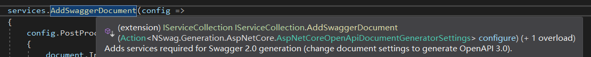
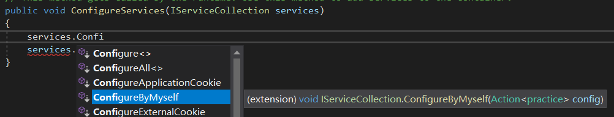
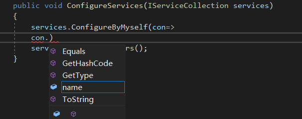

# C# dotnet Core 项目的Startup.cs中的一些相关知识
这就是一个记录我个人学习的地方。
## Startup里面的lambda表达式是在干什么？
&emsp;&emsp;问题起因在这里，在Limfx里面，我看到了一段这样的代码：
```csharp
public void ConfigureServices(IServiceCollection services)
{
    services.AddSwaggerDocument(config =>
    {
        config.PostProcess = document =>
        {
            document.Info.Version = "v1";
            document.Info.Title = "Limfx API";
            document.Info.Description = "ASP.NET Core web API for Limfx";
            document.Info.TermsOfService = "None";
            document.Info.License = new NSwag.OpenApiLicense
            {
                Name = "No lisence, all rights reserved",
                Url = string.Empty
            };
        };
    });
}
```
&emsp;&emsp;
嗯，那么问题就是：
作为一个lambda表达式中的形参config，实际参数是如何传递给config呢？嗯问题就是这样，下面开始解答：  
1. `AddSwaggerDocument()`方法  
&emsp;&emsp;
此方法接受一个委托，图片提供了一些信息。如这个action的参数问题。Action<>尖括号中的内容即这个lambda表达式参数的类型。在使用lambda时参数（比如在这里是config）可以使用点运算符点出这个类的成员与方法。



2. 参数的传递问题  
&emsp;&emsp; 
其实这里根本没有参数的传递，这里只传递了一个委托，这个委托处理了需要处理的东西。而究竟这个东西是怎么处理的则被框架封装了起来。所以不需要关注具体到底是做了怎样的处理，可以直接传递我想要做的事情。  
&emsp;&emsp;
嗯上面其实就是全部的解答过程了，但可能有一点抽象，下面举一个例子来说明这个过程。
使用创建一个程序默认配置的`Startup.cs`文件，添加如下代码：
```csharp
    public class practice
    {
        public string name;
    }
    public static class Extensions
    {
        public static void ConfigureByMyself(this IServiceCollection services,Action<practice> config)
        {
            var pra1 = new practice();
            Console.WriteLine(pra1.name ?? "");
            //这里很重要，是调用委托的地方
            //委托类型为Action<practice>，说明接受参数为practice类的对象
            //那么这里pconfig肯定是对这个对象进行了一系列的操作。
            //参数的传递就是在这里完成的
            config(pra1);
            Console.WriteLine(pra1.name);
            
        }
    }
    public class Startup
    {
        public Startup(IConfiguration configuration)
        {
            Configuration = configuration;
        }

        public IConfiguration Configuration { get; }

        // This method gets called by the runtime. Use this method to add services to the container.
        public void ConfigureServices(IServiceCollection services)
        {
            services.ConfigureByMyself(con => con.name = "Yuchen");
            services.AddControllers();
        }
        //省略掉了很多代码
    }
```
1. 为什么`services`可以点出很多方法  
&emsp;&emsp;
静态类静态方法中的`this`属于一个拓展方法，这里this指定的是`IServicesCollection`，那么所有`IServicesCollection`对象都可以使用这个拓展方法，当在函数`public void ConfigureServices(IServiceCollection services)`中对services使用点运算符的时候，即可以点出我们自定义的扩展方法。  
&emsp;

&emsp;&emsp;
如上图所示，因为在`Startup.cs`之外大部分内容框架已经做好并且封装起来。所以说可以点出来自定义的方法。

2. 为什么在写lambda表达式的时候参数可以点出东西来？  
如下图所示：

&emsp;&emsp;原因很简单，这里的方法接受一个`Action<practice>`委托，具体的函数上上图也有所描述。也就是这里接受的委托中，参数必定是一个`practice`类型的对象，所以practice类的对象可以点出自己的成员就不足为奇了。

