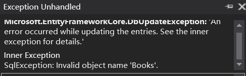
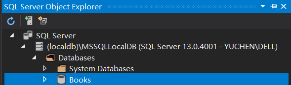

# 找Bug找到疯的一上午：
今天照着课本写一点Demo代码，然后就不停的`xxxxExcption`给我蹦出来，然后刚开始我认为我是连接字符串的问题，然后就开始去查连接字符串的相关知识。  
这次debug这么长的时间是不太懂得看报错，报错很多时候没有反应特别多的信息，但是还是返回了一些至关重要的信息。  
下面就是这个烦了我一上午的报错图片：  
  

# 关键句：`Invalid object name 'Books`
&emsp;&emsp;当碰到报错的时候，仔细琢磨一下是什么意思！首先他告诉我`Invalid object name Books`,就是说这个object的名字是无效的。那么我现在要做什么呢？  
——检索我现在有的Books，看看哪一个和报错的东西比较适合。  
下面放出所有于Books相关的内容：  
## 名为Books的数据库：
  

## 数据成员叫Books的`BooksContext`类
```csharp
public class BooksContext : DbContext
{
    private const string ConnectionString = @"server=(localdb)\MSSQLLocalDb;database=Books;trusted_connection=true";
    public DbSet<Book> Books { get; set; }
    protected override void OnConfiguring(DbContextOptionsBuilder optionsBuilder)
    {
        base.OnConfiguring(optionsBuilder);
        optionsBuilder.UseSqlServer(ConnectionString);

    }
}
```

## 类Book上面限定的Books
```csharp
[Table("Books")]
public class Book
{
    public int BookId { get; set; }
    public string Title { get; set; }
    public string Publisher { get; set; }
}
```
## 如何找到错误？
那么所有的关于Books的东西都在这里了，常规方法是把它们其中的一个改一改名字，看一看到底是哪一个就可以了。为啥我早上就没有想到呢？。。。   
xxxxxxxxx,口吐芬芳....  
**错误**就是因为在创建数据库的时候，数据库的名字起错了。本来应该是`[dto].[Books]`这样的一个映射，那么使用`[Table("Books")]`的时候就可以成功映射，而我却使用了默认的`[dto].[Table]`,就很dummkopf!!  
# 类如何与数据库映射
在本例中，我们想要使用`Book`类来映射数据库中的表`Books`，那么首先我们需要在定义`Book`类的时候在上面进行一个限制。即如下：
```csharp
[Table("Books")]
public class Book
{
    //some definations
}
```
这个时候数据库就和这个类产生了映射关系。